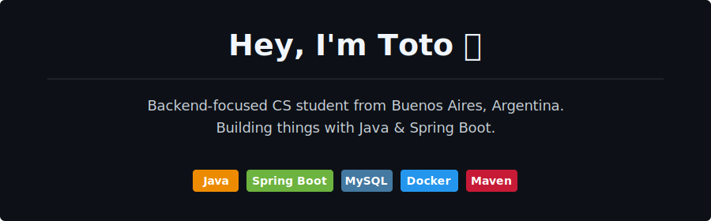

  

---

### About me

- 🎓 Third-year Computer Engineering student at **UADE**
- 💻 Backend developer focused on **Java 17 + Spring Boot**
- 🚀 Currently building **Toba** — a Jira-like ticket management app
- 🌱 Learning full-stack integration (React + Vite, Docker, CORS)

---

### Tech I work with

**Backend**   Java · Spring Boot · JPA/Hibernate · MySQL · Maven  
**DevOps**   Docker · Docker Compose · Git  
**Learning**   React · Vite · Axios · NoSQL

---

### Featured project

**[Toba](https://github.com/YOUR-USERNAME/toba)**

---

  <i>📫 Reach me at <a href="mailto:santiagolagares2005@gmail.com<">santiagolagares2005@gmail.com</a></i>

